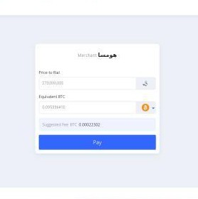

<div align="center">
    
</div>
<h1 align="center">Bitrah Gateway Laravel Package</h1>
<h2 align="center">Package for bitrah gateway</h2>

<div align="center">

[](https://opensource.org/licenses/MIT)

</div>

Bitrah is a [Laravel](http://laravel.com/) package that helping Laravel developers implement [Bitrah](http://bitrah.ir/) gateway .


- [Features](#features)
- [Getting Started](#getting-started)
- [Code](#code)
- [Documentation](#documentation)
- [Changelog](#changelog)
- [License](#license)


---


## Features
* Easy yet powerful.
* Store and Update All Transactions in data base automatically

## Getting Started
First, you should install bitrah on your Laravel project. 
```
composer require hshafiei374/bitrah
```
If use laravel < 5.4 put your webhook and callback url to VerifyCsrfToken $except array


## Code
It is easy to use.

Send a Request to Bitrah:
```php
Bitrah::submitRequest(orderId '1',rialValue '270000000');
```
Then we enter the ‌Bitrah gateway 



After the payment, bitrah call the callback url

And when the transaction is confirmed on the network, the web hook is executed

You can get transaction status manually:
```php
$bitrahTransaction = Bitrah::updateTransactionStatus(refId '2456');
```
Bitrah Transactions Table
```php
$table->bigIncrements('id');
            $table->string('token', 64)->nullable();
            $table->string('coin', 32)->nullable();
            $table->double('value')->nullable();
            $table->double('rial_value');
            $table->string('callback_url', 191);
            $table->string('webhook_url', 191);
            /*
             * شرح
                status
                    سفارش مشتری ثبت شده و مشتری در حال پرداخت است. بیت راه وضعیت تراکنش را در شبکه بررسی کرده و در صورت تأیید به سایت پذیرنده اعلام خواهد کرد.
                    0
                    مشتری سفارش خود را پرداخت کرده و تراکنش مذکور به تأیید شبکه رسیده است. بیت‌راه  پس از استعلام تأیید تراکنش وضعیت تأیید شده را ثبت کرده و به سایت پذیرنده اعلام می کند.
                    1
                    مشتری سفارش خود را پرداخت نکرده یا تراکنش مذکور در شبکه تأیید نشده است. پس از استعلام تأیید تراکنش وضعیت تأیید نشده را ثبت کرده و به سایت پذیرنده اعلام می کند.
                    2
                    مشتری سفارش خود را پرداخت کرده و تراکنش مذکور به تأیید شبکه رسیده است اما رقم پرداختی مشتری با رقم درخواستی مغایرت دارد.
                    3
                    سفارش مشتری منقضی شده است.
                    4
             * */
            $table->enum('status', ['0', '1', '2', '3', '4'])->default('0');
            $table->string('order_id', 64);
            $table->string('ref_id', 64)->unique();
            $table->timestamps();
```

## Documentation
You can find more information about Sanjab in [documentation](https://www.bitrah.ir/en/doc).


## Changelog
## v1.0.0
* submit a request and update transaction status.


## License

The MIT License (MIT). Please see [License File](LICENSE.md) for more information.
